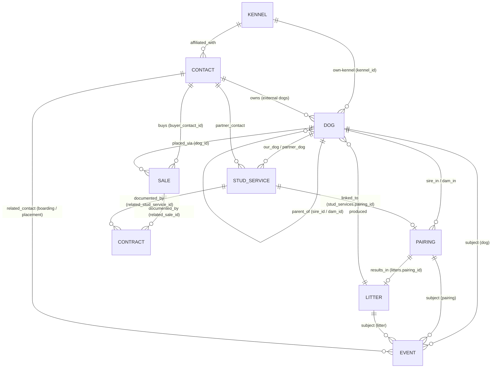

# Dog Breeding Management App
## Data Model & Architecture Proposal — v3

**Scope of this document:** the canonical data model, entity relationships, and storage architecture — the piece that has to be settled first and is expensive to change afterward. Everything else in the app is built on top of it. Personas, mockups, and per-epic acceptance criteria live in the build briefs, not here.

This is the current-state model as built through **Stage 4.5**. Stage 4.5 was an additive reconciliation, not a new model generation: it added a few fields, event types, and derived views without a new table or a Dexie version bump, so the v3 model still describes the app faithfully. A concise changelog is at the end (§16); the body describes what *is*, not the path that got here.

**What is built:** the schema, entities, and rules below are live in code through Stage 4.5, plus the test-planning fields (`Dog.planned_tests`, `Kennel.preferred_tests`, `Kennel.preferred_breeds`) and everything that hangs off them (§5.11, the §5.2 test-name vocabulary note, the §14 authoring surfaces, and the optional seed import) — landed independently of the stage sequence, per the Test Planning & Vocabulary addendum.

---

## 1. Design Principles

Six things drive every decision below, taken from the discovery doc's own architectural recommendations:

1. **No duplicate entry.** A puppy that becomes breeding stock is the same record, not a new one. An external stud you later co-own is the same record. A buyer who is also a co-owner or breeder is the same Contact record.
2. **Nothing is ever really deleted.** Breeding history is the product. Records get archived, not destroyed.
3. **One history mechanism, not ten.** Vaccinations, heat cycles, surgeries, titles, boarding stays, and pregnancy updates are all "a dated thing happened" — they live in one table, not one table each.
4. **The data layer is boring on purpose.** Modular pages with minimal coupling: pages talk to a small repository layer, never to raw storage.
5. **It has to survive as a static app.** No server, no build step required to run it, works offline after first load, exports to a portable JSON file. It is *hosted* (a URL) rather than *installed* (a file) — see §2.1 — but nothing about it requires server-side code.
6. **One canonical direction per relationship.** Every link is stored on exactly one side; the reverse is a derived query, never a second stored pointer. This is why `Pairing.resulting_litter_id`, `Sale.contract_id`, `StudService.contract_id`, and `Pairing.stud_service_id` do not exist — each of those relationships is owned by the other side and read back with an indexed query.

---

## 2. Storage Architecture

**Recommendation: IndexedDB, accessed through Dexie.js, vendored into the repository and loaded by relative path.**

This is a fully static app — Dexie is a client-side library, not a backend. It's a thin, well-documented wrapper around IndexedDB that gives you indexes, compound queries, and transactions without hand-rolling `IDBRequest` callback code. It is committed to the repo (`/vendor/dexie.min.mjs`) rather than pulled from a CDN, so the app keeps working with no network and takes on no external runtime dependency.

With photos out of scope, the case for IndexedDB rests on **querying and write ergonomics**, not storage size:

| Option | Why / why not |
|---|---|
| **localStorage** | Synchronous (blocks the UI on every write), no indexes (every "dogs where status = active" is a full parse-and-scan), one big JSON blob you must re-serialize on each change, ~5–10MB cap. Fine only as a small settings store (last backup date, UI prefs). |
| **IndexedDB + Dexie (recommended)** | Async, per-record writes inside transactions, and — the real win — **native indexes** for the compound queries this app lives on: a dog's timeline (`[subject_type+subject_id]`), pedigree parent lookups (`sire_id`/`dam_id`), status/breed filters. Capacity is a non-issue for text records. |
| **SQL.js (SQLite compiled to WASM)** | Attractive because this domain is genuinely relational (real JOINs, enforced FKs). Rejected as the *primary* store because SQL.js has no built-in persistence — you must serialize the whole DB to a file and reload it, or bolt on a persistence layer. Meaningfully more complexity for a solo build. Worth revisiting only if reporting/COI queries become a real bottleneck. |

**Practical implementation note:** the JS store/module is named `HistoryEvent` (not `Event` — `Event` collides with the DOM global).

**Schema versioning:** the full schema is declared in a **single `db.version(1).stores({...})` block** covering all nine tables. Dexie's additive-versioning model (`.version(2)`, `.version(3)`, …) exists to migrate *real* data safely; with nothing shipped there is nothing to migrate, so a single collapsed block is correct and can still be edited in place (reconciled locally by Reset App + re-seed). **The next `.version(2)` block is added only at the first real release** — from then on, versioning is additive as Dexie expects and shipped version blocks are never edited again.

### 2.1 Hosting, offline, and data locality (GitHub Pages)

- **Served over HTTPS.** This is what makes `<script type="module">` imports across `nav.js` / `db.js` / repos work at all — module scripts are blocked by CORS on `file://`. Same in local dev: run a static server (`python3 -m http.server`, `npx serve`), never open the file directly.
- **Genuine offline** comes from two things a hosted origin enables and a bare file cannot: Dexie vendored locally (above), and a **service worker** (`sw.js`) that caches the app shell so repeat visits work with no network.
- **IndexedDB is origin-scoped**, with real consequences:
  - Each user's data lives in *their own browser* under the app's origin (`<user>.github.io`). Hosting the app publicly does **not** expose anyone's records — data never leaves the device.
  - If the origin ever changes (custom domain, repo rename, moving hosts), existing data does **not** follow. **JSON export/restore is the migration path**, not merely a convenience — see §9.
  - The Dexie database has a **distinct, app-specific name** (`KennelOSBreedingApp`) so it can't collide with anything else on the same `github.io` account (project pages share one origin as path prefixes, not subdomains).
  - `navigator.storage.persist()` is called on first run so the browser won't silently evict a kennel's records under storage pressure.

### Cross-cutting rules (apply to every entity, not repeated per table below)
- `id`: UUID v4 string, generated client-side (`crypto.randomUUID()`). No auto-increment — avoids merge conflicts on JSON import/restore.
- `is_archived`: boolean. Soft delete only. Archived records are hidden from active lists/pickers but remain resolvable for pedigree, history, and reports.
- `created_at` / `updated_at`: full ISO-8601 **datetime** strings, set automatically.
- **Date-only fields** (`date_of_birth`, `date_of_death`, `event_date`, `event_end_date`, `whelp_date`, `planned_date`, etc.) are stored as **`YYYY-MM-DD` strings**, never full datetimes. They compare correctly with lexicographic `<`/`>=` (which rules like "`date_of_death` ≥ `date_of_birth`" rely on) and avoid timezone drift. Only `created_at`/`updated_at` carry a time component.
- Every entity is its own Dexie table (object store), related by `id` references — not nested/embedded documents. This keeps CSV import, editing, and archiving simple and avoids duplicating a dog's data inside five other tables.

---

## 3. The Two Decisions Everything Else Depends On

### 3.1 One `Dog` table for breeding stock, puppies, *and* external dogs

Rather than separate `Dog` / `Puppy` / `ExternalDog` entities, there is a single `Dog` table. A puppy record is created the moment it's entered (typically at whelping, as part of the litter roster) with `status = "puppy"` and `litter_id` set. Promoting it to breeding stock is a **status change on the same record** — `status = "active_breeding"` — not a new record and not a copy. An outside stud used once is entered with `ownership_type = "external"`; if you later co-own or acquire that dog, you update `ownership_type`, you don't create a duplicate.

This single decision satisfies "promote puppies without re-entering data" and "avoid duplicate data entry for external dogs" — both become free consequences of the schema rather than features you have to build.

### 3.2 One `Event` table for all history

Vaccinations, medications, surgeries, heat cycles, progesterone tests, weight checks, titles earned, injuries, vet visits, evaluations, boarding stays, placements, and pregnancy updates are all structurally the same thing: *a dated occurrence, attached to something, with type-specific details.* They live in one `Event` table with a `subject_type` / `subject_id` pair (polymorphic reference) so an event can be logged against a **Dog**, a **Pairing**, or a **Litter**. This makes a single "timeline view" of any dog, pairing, or litter possible without per-type code.

An event is either an **instant** (a single dated occurrence) or a **span** (a start `event_date` plus an optional open end `event_end_date`) — see the `duration` attribute in §5.2. This is the one distinction the whole scheduling/logistics layer rests on.

---

## 4. Entity-Relationship Diagram



Edges worth calling out:
- **`CONTACT ||--o{ EVENT`** is the `Event.related_contact_id` FK — the person/kennel on a boarding stay, or the buyer on a placement drop-off. Indexed; guarded in `CONTACT_REFERENCES` (§10).
- **`SALE ||--o{ CONTRACT`** and **`STUD_SERVICE ||--o{ CONTRACT`** are *one-to-many* (Contract owns the FK), because a sale/stud-service can carry more than one contract (e.g. sale + addendum). The reverse is a derived query — Contract is never pointed *at*.
- **`STUD_SERVICE ||--o| PAIRING`** is canonical on `StudService.pairing_id`, mirroring `Litter.pairing_id`.
- **`KENNEL ||--o{ DOG`** (own-kennel) tags a dog to one of the user's own kennels.
- A buyer is a Contact — there is no separate `Buyer` entity. Binary attachments are deferred (§12), so there is no `Attachment` entity.

---

## 5. Entity Definitions

### 5.1 Dog
*Every animal that matters to the program: your breeding stock, puppies at every life stage, and external dogs owned by other people.*

| Field | Type | Required | Notes |
|---|---|---|---|
| id | UUID | ✓ | |
| call_name | string | ✓ | |
| registered_name | string | | |
| sex | enum: male / female / unknown | ✓ | |
| date_of_birth | date (`YYYY-MM-DD`) | | nullable for external dogs with unknown DOB |
| dob_is_estimated | boolean | | flags approximate DOB (common for external dogs) |
| date_of_death | date (`YYYY-MM-DD`) | | |
| breed | string | ✓ | free-text with autocomplete from existing values; indexed for filtering |
| color_markings | string | | |
| registry | string | | e.g. AKC, UKC, CKC |
| registration_number | string | | |
| microchip_id | string | | |
| sire_id | FK → Dog | | nullable — self-referencing |
| dam_id | FK → Dog | | nullable — self-referencing |
| ownership_type | enum: owned / co_owned / external / leased_in / leased_out | ✓ | |
| owner_contact_id | FK → Contact | | required in practice when ownership_type = external or leased_in |
| co_owner_contact_ids | array of FK → Contact | | co-ownership is common in breeding programs. **Multi-entry indexed** (`*co_owner_contact_ids`) so "dogs co-owned by contact X" is a real query, not a scan. A co-owning buyer lands here directly (buyers are Contacts). |
| litter_id | FK → Litter | | set only if born in-house |
| breeder_kennel_id | FK → Kennel | | **Built.** Nullable, indexed, guarded in `KENNEL_REFERENCES`. The kennel that *produced* this dog — your own for an in-house litter, or an outside contact's kennel (`Kennel.is_own_kennel: false`) for a dog you acquired. Distinct from `kennel_id` below, which tracks which of your kennels the dog belongs to *now*. Auto-prefilled (never overridden) when a Litter is linked and that litter's dam is your own dog (`ownership_type` owned/co_owned): copies the dam's own `kennel_id`. Left blank — never guessed — when the dam isn't yours, since that says nothing about which kennel bred the dog. |
| kennel_id | FK → Kennel | | Which of the user's own kennels this dog belongs to. Nullable — missing means "unassigned," not an error; never blocks a save. Only meaningful for owned/co-owned dogs (external/leased-in dogs carry someone else's kennel identity via `owner_contact_id`). Indexed for kennel-scoped queries. |
| planned_tests | string[] | | **Built (§5.11).** Unindexed. This dog's intended health/genetic tests. Plain strings, not FKs — never enter the reference registry. |
| recorded_coi | object `{value, method, source, as_of_date}` | | **Built (Stage 5, brief §2).** Nullable, unindexed. An optional, **user-attested** coefficient of inbreeding recorded from a lab/registry — the app stores it, never computes it (this **replaces** the computed-COI plan in §7). `value` is a percent number; the rest are strings/date; any subset may be null. Not an FK — never enters the reference registry. Named `recorded_coi` (not `coi`) so a future `computed_coi` can sit beside it. |
| status | enum: puppy / active_breeding / retired_breeding / pet_home / for_sale / deceased / external_reference | ✓ | drives which lists a dog appears in |
| status_date | date (`YYYY-MM-DD`) | | when status last changed |
| disposition | enum: undecided / keeping / available / placed | | **Built.** Nullable, **unindexed** (same posture as `recorded_coi` — persists and rides the backup, but nothing queries it by key). The breeder's *intent* for a dog — "keeping or offering?" — recorded before any `Sale` exists. Deliberately **orthogonal to `status`**: a puppy you're offering stays `status: puppy` and carries `disposition: available` (it can't be both `puppy` and `for_sale` in one single-valued field), and `Sale` still owns the actual transaction once a buyer appears. Nullable/unset reads as `undecided`; `available` is the single stable filter key a future prospective-families view selects on. Not an FK — never enters the reference registry. |
| notes | text | | |
| is_archived | boolean | ✓ | |

> **Why not a separate Puppy table?** A puppy has every field a breeding dog has (name, DOB, sex, parents, health events). The only thing that differs is *status*. Splitting them would mean copying data at promotion time — the exact duplication the discovery doc asks us to avoid.

> **Photos deferred (§12).** No `primary_photo_attachment_id`. If photos return, it comes back exactly as before.

### 5.2 Event
*The generic history/log table. One row per "dated thing that happened."*

| Field | Type | Required | Notes |
|---|---|---|---|
| id | UUID | ✓ | |
| subject_type | enum: dog / pairing / litter | ✓ | polymorphic target |
| subject_id | FK (by subject_type) | ✓ | |
| related_dog_id | FK → Dog | | e.g. the breeding partner on a `breeding_tie` event. A *second* way an Event references a Dog — the delete-guard in §10 checks both this and `subject_id`. Indexed. |
| related_contact_id | FK → Contact | | the person/kennel on a `boarding` stay, or the buyer on a `placement` drop-off. **Indexed**; guarded in `CONTACT_REFERENCES` (§10). Never a field inside `details` — only a real FK belongs at the top level. |
| event_type | enum | ✓ | see catalog below |
| event_date | date (`YYYY-MM-DD`) | ✓ | for a span, this is the **start** |
| event_end_date | date (`YYYY-MM-DD`) | | **Unindexed nullable field.** Null for instants; the (optional, open-ended) end for spans. Only meaningful on `duration: span` types; a non-null value on an instant type soft-warns and is dropped by the CSV importer, and the event form hides the field for instant types. |
| title | string | ✓ | short summary shown in timeline |
| details | object | | shape varies by event_type — see catalog |
| reminder_date | date (`YYYY-MM-DD`) | | **Indexed (Stage 5, brief §3).** Powers the reminder engine: any event with a non-null `reminder_date` that is not archived and not dismissed is a pending reminder (`eventRepo.getReminders`). This is the app's **single** future-dated mechanism — there is no Reminder table and no recurrence rule (recurrence is the log-the-next workflow). |
| reminder_dismissed | boolean | | **Built (Stage 5, brief §3).** Unindexed; absent/false = pending. Dismissing a reminder sets this true — the event stays on its timeline (dismissal is not archiving and not a status). |
| cost | decimal | | powers the future financial-tracking feature |
| notes | text | | |
| is_archived | boolean | ✓ | |

**Event type catalog** (a controlled vocabulary in `vocab.js`, not a hard-coded UI enum). `duration` is `instant` (single dated occurrence) or `span` (has a start and an optional open end). `related_contact` marks the two types that carry a top-level `related_contact_id`.

| event_type | subject_type | duration | related_contact | example `details` shape |
|---|---|---|---|---|
| vaccination | dog | instant | | `{vaccine, lot_number, next_due}` |
| preventative | dog | instant | | `{product, dose}` |
| genetic_test | dog | instant | | `{panel_name, lab, result}` |
| ofa_pennhip | dog | instant | | `{joint, method, rating}` |
| breed_specific_test | dog | instant | | `{test_name, result}` |
| illness | dog | instant | | `{diagnosis, treatment}` |
| medication | dog | **span** | | `{drug, dose, frequency}` — the course's end is `event_end_date`, not a details field |
| surgery | dog | instant | | `{procedure, vet, outcome}` |
| vet_visit | dog | instant | | `{reason, vet, findings}` |
| injury | dog | instant | | `{description, severity}` |
| weight_check | dog | instant | | `{weight_lbs}` — feeds future growth charts |
| milestone | dog | instant | | `{description}` — e.g. eyes open, first steps |
| evaluation | dog | instant | | `{evaluator, temperament_notes, structure_notes}` — structured temperament/structure assessment |
| title_earned | dog | instant | | `{title_abbreviation, organization}` |
| heat_cycle | dog | **span** | | `{notes}` — the cycle start is `event_date`, the end is `event_end_date` |
| boarding | dog | **span** | ✓ | `{location, boarding_reason, dropoff_time, pickup_time, notes}` — a dog away from home; `related_contact_id` is where it's staying |
| placement | dog | instant | ✓ | `{placement_time, location, notes}` — a puppy drop-off; `subject_id` is the puppy, `related_contact_id` is the buyer |
| breeding_tie | pairing | instant | | `{tie_date, method}` |
| progesterone_test | pairing | instant | | `{value, lab}` |
| ultrasound | pairing | instant | | `{confirmed, estimated_count}` |
| pregnancy_update | pairing | instant | | `{note}` |
| whelping_summary | litter | instant | | `{total_born, live_born, notes}` |
| note | dog / pairing / litter | instant | | free text |

**Boarding specifics:** `boarding_reason` is *suggest-not-enforce* (a combobox over a starter set — stud service, co-owner rotation, foster, grow-out, owner travel, whelp assist, other — never a validated enum). `location` stays a plain string in `details`; the person/kennel is the top-level `related_contact_id`. `dropoff_time` / `pickup_time` (and `placement`'s `placement_time`) are **inert display strings** — never parsed or compared.

> **Test-name strings as vocabulary — built (§5.11).** The test-name `details` fields on `genetic_test` (`panel_name`), `breed_specific_test` (`test_name`), and `ofa_pennhip` (`joint`, combined with `method`) are the "seen-in-events" half of the shared suggestion vocabulary, unioned with `Kennel.preferred_tests` (`eventRepo.getTestTokens()` / `kennelRepo.getVocabulary()`).

### 5.3 Pairing
*A breeding attempt — planned or actual — between two dogs.*

| Field | Type | Required | Notes |
|---|---|---|---|
| id | UUID | ✓ | |
| sire_id | FK → Dog | ✓ | |
| dam_id | FK → Dog | ✓ | |
| pairing_type | enum: planned / actual | ✓ | |
| method | enum: natural / ai_fresh / ai_chilled / ai_frozen / surgical_ai | | |
| status | enum: planned / bred / confirmed_pregnant / not_pregnant / whelped / failed / cancelled | ✓ | |
| planned_date | date (`YYYY-MM-DD`) | | |
| expected_due_date | date (`YYYY-MM-DD`) | | |
| notes | text | | |
| is_archived | boolean | ✓ | |

> The pairing↔stud-service link is owned by `StudService.pairing_id` (§5.8), and the pairing→litter link by `Litter.pairing_id` (§5.4). Pairing Detail shows both as **derived queries** — there is no `stud_service_id` or `resulting_litter_id` stored on Pairing.

> Individual breeding ties, progesterone tests, and ultrasounds are **not** inline fields here — they're `Event` rows with `subject_type = "pairing"`. That keeps Pairing lean and gives every pairing a free timeline.

### 5.4 Litter
| Field | Type | Required | Notes |
|---|---|---|---|
| id | UUID | ✓ | |
| pairing_id | FK → Pairing | | nullable — allows importing historical litters that predate a formal pairing record. **This is the canonical link between litter and pairing.** |
| dam_id | FK → Dog | ✓ | **Authoritative for the litter's dam.** Denormalized so a litter imported without a pairing still records parentage. When `pairing_id` is set, validate on write that it matches the pairing's `dam_id` (warn on mismatch rather than hard-block, for import resilience). |
| sire_id | FK → Dog | ✓ | Authoritative for the litter's sire; same sync-and-warn rule as `dam_id`. |
| whelp_date | date (`YYYY-MM-DD`) | | |
| litter_registration_number | string | | |
| puppies_born_total | integer | | point-in-time fact recorded at whelping — kept even if some puppies aren't individually entered as Dog records right away |
| puppies_born_alive | integer | | |
| puppies_born_deceased | integer | | |
| status | enum: expected / whelped / weaning / ready / placed / closed | ✓ | |
| expected_price_male | decimal | | per-litter default; `sale.js` prefills a new Sale's `price` with this when the sold dog's `sex = male` and its `litter_id` points here, only if `price` is still empty |
| expected_price_female | decimal | | same as above, for `sex = female` |
| expected_deposit_amount | decimal | | per-litter default; prefills a new Sale's `deposit_amount` for any puppy from this litter, only if still empty |
| notes | text | | |
| is_archived | boolean | ✓ | |

The puppy roster itself is **not stored on Litter** — it's derived by querying `Dog WHERE litter_id = this.id`. Storing it twice would let the two get out of sync. (Same reasoning as the Litter↔Pairing link living only on `Litter.pairing_id`.)

### 5.5 Buyer — not a separate entity
*A buyer is a person, and Contact is already the person table — one record per person (Design Principle #1). This section number is retained so cross-references stay stable.*

- A buyer is a **Contact** (§5.9); `Sale.buyer_contact_id → Contact` (§5.6).
- `waitlist_status` lives on Contact, indexed to power the buyer-view filter.
- The person's acquisition channel is `Contact.first_contact_source` (§5.9).
- The "buyer" role is a `contact_type` value and/or a non-null `waitlist_status`; **"Buyers / Waitlist" is a filtered Contact view**, not a table, repo, or page.
- A co-owning buyer drops straight into `Dog.co_owner_contact_ids` — no seam.

### 5.6 Sale (Placement)
*A bridge entity between a Dog and a Contact (the buyer). Deliberately a separate table, not a field on Dog — a dog can be reserved, returned, and re-placed, and each of those is a fact worth keeping.*

| Field | Type | Required | Notes |
|---|---|---|---|
| id | UUID | ✓ | |
| dog_id | FK → Dog | ✓ | |
| buyer_contact_id | FK → Contact | ✓ | Indexed. |
| sale_date | date (`YYYY-MM-DD`) | | |
| price / deposit_amount | decimal | | Prefilled on a new sale from the dog's `Litter.expected_price_male/_female`/`expected_deposit_amount` (§5.4) when `dog_id` names a puppy with a `litter_id`, only into fields still empty — a plain form prefill, not a stored link. |
| deposit_date / balance_paid_date | date (`YYYY-MM-DD`) | | |
| placement_type | enum: pet / show / breeding_rights / co_own | ✓ | a `co_own` placement pairs naturally with adding the buyer to the dog's `co_owner_contact_ids` (a confirmed action, written through `dogRepo`) |
| lead_source | string | | Free text with `<datalist>` autocomplete; how *this specific sale* came in. Prefills from the buyer's `first_contact_source` but may differ (same buyer, two dogs, two channels — which is why it can't live only on the person). Not indexed. |
| status | enum: reserved / deposit_paid / paid_in_full / delivered / returned / cancelled | ✓ | a `returned` sale stays visible on the dog's record — status records what happened, archive only hides |
| notes | text | | |
| is_archived | boolean | ✓ | |

> The sale↔contract link is canonical on `Contract.related_sale_id` (§5.7). A sale's contracts are the derived query `contracts WHERE related_sale_id = this.id` — which **permits more than one** (sale + addendum). There is no `contract_id` on Sale.

> **Placement drop-offs are prompted here, not stored here.** On sale create / a delivery-adjacent status, the UI offers to log a `placement` event (§5.2) pre-filled with the puppy and buyer. The event carries **no stored link back to the Sale** — same posture as boarding-not-linked-to-StudService.

### 5.7 Contract
*Generic enough to cover sale, stud service, co-ownership, and lease agreements — one table instead of four near-identical ones. A leaf entity: nothing points at it, so it is always hard-deletable.*

| Field | Type | Required | Notes |
|---|---|---|---|
| id | UUID | ✓ | |
| contract_type | enum: sale / stud_service / co_own / lease / other | ✓ | |
| status | enum: draft / sent / signed / declined / cancelled / void | ✓ | Default `draft`. Indexed. **Orthogonal to `contract_type`** — any type can be `draft` or `cancelled`. **Not a locked state machine** (moves any direction, no confirmation dialogs — contracts get redrafted/re-sent often). A `cancelled`/`declined` contract normally stays **un-archived** so a fallen-through deal stays visible: `is_archived` hides, `status` says where the deal stands. |
| related_sale_id | FK → Sale | | **canonical** sale↔contract link. Indexed. |
| related_stud_service_id | FK → StudService | | **canonical** studservice↔contract link. Indexed. |
| related_dog_id | FK → Dog | | **canonical** dog↔contract link, for the types with no linked Sale/StudService to reach a dog through: `lease` / `co_own` / `other`. Indexed, in `DOG_REFERENCES`. Only shown on the form for those three types; `contractRepo.create`/`update` force it `null` for `sale`/`stud_service` regardless of what's passed in, so a stray link from a mid-edit type change can never persist or surface on the wrong dog's Contracts panel. Dog Detail renders a derived Contracts panel (`contractRepo.getByDog`) alongside its existing Sales/Stud Services panels. |
| title | string | | |
| signed_date | date (`YYYY-MM-DD`) | | |
| lease_start_date | date (`YYYY-MM-DD`) | | Only meaningful/shown when `contract_type = lease`. Unindexed. Cleared if `contract_type` changes away from `lease` (same "hidden means doesn't apply" posture as `Dog.kennel_id` when ownership_type hides it). |
| lease_end_date | date (`YYYY-MM-DD`) | | Same posture as `lease_start_date`. Soft-warned (not blocked) if earlier than `lease_start_date`. |
| terms_summary | text | | |
| notes | text | | |
| is_archived | boolean | ✓ | |

> **The "governing contract" of a sale is a derived rule, not a stored flag.** Because contracts-for-a-sale is a query, a sale can carry several; Sale Detail lists them all (newest first, each with its status badge) so "reserved → sent → buyer backed out (`cancelled`) → re-sent → `signed`" reads as visible history. Where a rule needs "the governing contract," it is computed by `contractRepo.governingContract()`: **the most recent `signed` contract** (by `signed_date`, falling back to `created_at`), or **none** if none is signed. Sale Detail renders this as a single derived line, which is the one place the rule is exercised. A stored active-flag would re-introduce the 1:1-ish constraint in a new disguise.

> **Scanned-document link deferred (§12).** With attachments descoped, a contract is captured as structured text (`terms_summary`) plus metadata.

### 5.8 StudService
*Covers both directions: your stud servicing an outside female, and you using an outside stud on your dam.*

| Field | Type | Required | Notes |
|---|---|---|---|
| id | UUID | ✓ | |
| direction | enum: outgoing / incoming | ✓ | outgoing = our dog is the stud; incoming = our dog is the dam |
| our_dog_id | FK → Dog | ✓ | |
| partner_dog_id | FK → Dog | ✓ | the external dog |
| partner_contact_id | FK → Contact | ✓ | owner of the partner dog |
| fee_amount | decimal | | |
| fee_structure | enum: flat_fee / pick_of_litter / flat_plus_pick / other | | |
| pairing_id | FK → Pairing | | **canonical** studservice↔pairing link (mirrors `Litter.pairing_id`). Indexed. Links to the actual breeding record and outcome. |
| status | enum: arranged / in_progress / completed / failed / cancelled | ✓ | |
| sent_date | date (`YYYY-MM-DD`) | | Optional. Date the dog/semen was sent out (e.g. chilled/frozen semen shipped, or a dog sent to the partner). Unindexed — never queried/filtered/sorted at the DB level. |
| returned_date | date (`YYYY-MM-DD`) | | Optional. Date the dog/semen was returned. Unindexed, same posture as `sent_date`. |
| result_notes | text | | |
| is_archived | boolean | ✓ | |

> The contract link is owned by `Contract.related_stud_service_id` (§5.7); Stud Service Detail's contract panel is the derived query. There is no `contract_id` on StudService.

> **"Create Pairing from this Stud Service" — direction mapping:** `outgoing` → `pairing.sire_id = our_dog_id`, `pairing.dam_id = partner_dog_id`; `incoming` → `pairing.sire_id = partner_dog_id`, `pairing.dam_id = our_dog_id`. Sex-mismatch stays warn-don't-block on the resulting pairing.

> **Boarding is prompted here, not stored here.** On stud-service create (especially `incoming`), the UI offers to log a `boarding` event pre-filled with `boarding_reason: stud_service` and the partner contact. No stored link to the StudService.

### 5.9 Contact
*Breeder network: vets, other breeders, co-owners, referral sources — and buyers.*

| Field | Type | Required | Notes |
|---|---|---|---|
| id | UUID | ✓ | |
| name | string | ✓ | |
| kennel_id | FK → Kennel | | |
| contact_type | array of enum: breeder / vet / groomer / buyer_referrer / co_owner / buyer / other | | multi-select — a person can be more than one thing |
| phone / email / address | string | | |
| waitlist_status | enum: none / active / fulfilled | | **Indexed** — the buyer-view filter queries it directly. A waitlisted inquiry that never becomes a sale is a Contact with `waitlist_status = active` and no Sale record. |
| first_contact_source | string | | Free text with `<datalist>` autocomplete; first-touch/acquisition channel for the *person* — "how this relationship started." Exists even for an inquiry with no sale. Not indexed. |
| notes | text | | relationship history lives here as free text |
| is_archived | boolean | ✓ | |

> **"Buyers / Waitlist" is a filtered Contact view**, not a separate entity — contacts with a `buyer` role and/or a non-null `waitlist_status`. Reachable from a landing tile and the `?buyer=1` filter on the Contact list.

> **Deferred (stated, not built):** an inquiry is really a *dated event-with-a-channel on a Contact*. If a real lead pipeline is ever wanted (multiple inquiries over time, which litter each was about, inquired → waitlisted → purchased), that's where it goes — Events with `subject_type` extended to `contact`. One `first_contact_source` field today doesn't justify it; the door is cut.

### 5.10 Kennel
| Field | Type | Required | Notes |
|---|---|---|---|
| id | UUID | ✓ | |
| kennel_name | string | ✓ | |
| prefix | string | | registered kennel prefix |
| location | string | | |
| is_own_kennel | boolean | | Default `false`. Distinguishes the user's own kennel(s) from an outside contact's kennel (e.g. a co-breeder's). Not indexed — kennel counts are small enough that scanning is free. No exclusivity constraint; 2+ kennels can be flagged own (multi-kennel view-scoping is deferred). |
| preferred_tests | string[] | | **Built (§5.11).** Unindexed. The kennel's authored health-test panel and shared suggestion vocabulary. |
| preferred_breeds | string[] | | **Built (§5.11).** Unindexed. The kennel's breed-suggestion pool — the seed import's breed payload. Feeds the free-text `breed` autocomplete alongside distinct-breeds-already-on-dogs, so a seeded breed can suggest before the first dog exists. Plain strings, suggest-not-lock; never FKs, never in the registry. |
| notes | text | | |
| is_archived | boolean | ✓ | |

### 5.11 Test-planning fields — built
*Landed independently of the Stage 1–4.5 sequence, per the Test Planning & Vocabulary addendum — it is Stage-5-adjacent but depended on nothing in Stage 5. Nothing about it changed the schema version, the reference registry, or the JSON backup format. The behavioral spec lives in the Test Planning & Vocabulary addendum; this section is the settled design it was built against.*

- **Three unindexed string arrays:** `Dog.planned_tests` (per-dog intent), `Kennel.preferred_tests` (kennel panel + test vocabulary), and `Kennel.preferred_breeds` (kennel breed-suggestion pool, added with the seed import — §5.11 addendum §8). Dexie needs a `db.version(N)` bump only to add/change *indexes*, not plain fields — so all three are **zero-migration**. No `referenceRegistry.js` change, no `format_version` change; all ride the JSON backup for free (§9 dumps whole records).
- **Strings, never FKs — deliberately.** The moment a test became a `test_definition_id` pointing at a catalog table, it would join the reference registry: you couldn't rename/remove a test while any event referenced it, and an off-list test from a messy import would be *blocked instead of saved*. That contradicts the app's warn-don't-block / import-resilience posture (§8). Tests stay inert strings; the list stays advisory.
- **Shared vocabulary = the join anchor.** Event-form suggestions on `genetic_test` / `breed_specific_test` / `ofa_pennhip` = `Kennel.preferred_tests` ∪ distinct test tokens already seen in existing events (append-only). Suggest, never force.
- **Completeness is advisory, never a hard fraction.** For each planned token, Dog Detail shows whether a matching (case-insensitive, trimmed) test event exists, and flags the rest as *"planned — no matching event found, verify."* No "3/5" badge asserting completeness.
- **Seeding is forward-only, at create, owned/co-owned only.** `Dog.planned_tests` seeds from the resolved own-kennel's `preferred_tests` once, at dog creation; after that it's the dog's own. Editing the panel never re-syncs existing dogs.
- **Optional seed import (addendum §8–9).** A shipped `breed, test_name` CSV (`KennelOS/resources/common_tests_by_breed_seed.csv`) appends each test to `Kennel.preferred_tests` and each breed to `Kennel.preferred_breeds` (dedupe-on-write). Shared parse/group/apply logic (`data/seedImport.js`) drives two entry points: a standalone view (`pages/kennel-tests-import.{html,js}`, from Import/Export, file-picker + preview) and an opt-in "Prefill common health tests" section in the first-run kennel-setup wizard (`assets/kennelSetupUI.js`, per-breed checkboxes over the bundled file, fetched directly). It is **not** routed through the generic `csvImport.js` record engine — vocabulary-append is a different shape than entity match-or-create. Nothing ships in-app; the blank-until-authored-or-imported posture holds uniformly for both breeds and tests.
- **Where it lives:** `dogRepo.addPlannedTests`, `kennelRepo.addPreferredTest`/`removePreferredTest`/`getVocabulary`/`addPreferredBreed`/`getBreedVocabulary`, `eventRepo.getTestTokens`/`testTokensOf` (repo layer); seeding resolution in `dog.js`'s `save()`; the breed-pool union into the dog-form datalist in `dog.js`; the kennel panel editor in `kennels.js`; the Planned Tests panel + advisory completeness view and "Copy plan from…" in `dog.js`; the combobox wiring in `eventForm.js`/`vocab.js`; the shared seed logic in `data/seedImport.js`, wired into `pages/kennel-tests-import.js` and the setup wizard in `assets/kennelSetupUI.js`.

---

## 6. Relationship Summary

| From | To | Cardinality | Meaning |
|---|---|---|---|
| Dog.sire_id | Dog.id | many → one | biological father |
| Dog.dam_id | Dog.id | many → one | biological mother |
| Dog.litter_id | Litter.id | many → one | born into this litter |
| Dog.breeder_kennel_id | Kennel.id | many → one | kennel that produced this dog (own or outside); reverse in `KENNEL_REFERENCES` |
| Dog.owner_contact_id | Contact.id | many → one | external owner |
| Dog.co_owner_contact_ids | Contact.id | many → many | co-owners (multi-entry indexed) |
| Dog.kennel_id | Kennel.id | many → one | own-kennel tag (owned/co-owned only); reverse in `KENNEL_REFERENCES` |
| Event.subject_id | Dog / Pairing / Litter | many → one | polymorphic |
| Event.related_dog_id | Dog.id | many → one | secondary party (e.g. breeding partner) |
| Event.related_contact_id | Contact.id | many → one | person/kennel on a boarding stay, or buyer on a placement |
| Pairing.sire_id / dam_id | Dog.id | many → one each | |
| Litter.pairing_id | Pairing.id | many → one | canonical litter↔pairing link (reverse is derived) |
| Litter.sire_id / dam_id | Dog.id | many → one each | authoritative litter parentage |
| StudService.pairing_id | Pairing.id | many → one | canonical studservice↔pairing link (reverse is derived) |
| Sale.dog_id | Dog.id | many → one | a dog may have several Sale records over its life |
| Sale.buyer_contact_id | Contact.id | many → one | buyer (a Contact, not a separate Buyer) |
| Contract.related_sale_id | Sale.id | many → one | canonical sale↔contract link (reverse derived; permits >1 per sale) |
| Contract.related_stud_service_id | StudService.id | many → one | canonical studservice↔contract link (reverse derived) |
| StudService.our_dog_id / partner_dog_id | Dog.id | many → one each | |
| StudService.partner_contact_id | Contact.id | many → one | owner of the partner dog |
| Contact.kennel_id | Kennel.id | many → one | affiliation |

Every reverse of the above is a **derived query on an indexed field**, never a stored back-pointer.

---

## 7. Pedigree, Ancestor/Descendant Lookup, and COI

No separate pedigree table is needed — it's entirely derivable from `Dog.sire_id` / `Dog.dam_id`:

- **Multi-generation pedigree / ancestor lookup:** recursive walk up `sire_id`/`dam_id` from a given dog, N generations deep.
- **Descendant lookup:** both `sire_id` and `dam_id` are indexed, so a dog's direct children are two cheap indexed queries (`where('sire_id').equals(id)` / `where('dam_id').equals(id)`, merged) run live per call — no session-level cache needed. Cheap at kennel-scale record counts.
- **Shared ancestor / intersection analysis:** walk both dogs' ancestor trees to a chosen depth and intersect the sets of ancestor IDs.
- **COI (coefficient of inbreeding):** ~~once shared ancestors are found, apply Wright's path-counting formula over the two dogs' pedigree trees.~~ **Superseded in Stage 5 (brief §1/§11).** App-computed COI, shared-ancestor intersection, and pairing/offspring relatedness were **not** built; Stage 5 records an optional user-attested value on the Dog instead (`Dog.recorded_coi`, §5.1). Computed COI remains a clean future re-entry — it would return as a `computed_coi` value beside `recorded_coi` (name already reserved), bringing back the ancestor walk above (cycle-safe via a visited-set) with a stated depth and pedigree-completeness metric. The ancestor/descendant lookup and pedigree render described here are unaffected and stay.

---

## 8. CSV Import Strategy

General pattern, applied consistently across entities by a single generic engine (`data/csvImport.js`):

1. **Match-or-create by natural key**, not by internal UUID. For Dog, the natural key is `registered_name + date_of_birth` (fallback: `call_name + date_of_birth` if unregistered). For other entities, a sensible human-identifiable combination is used.
2. Relationship columns (e.g. a litter CSV's `dam_name`) are **resolved against existing records at import time**; unresolved references are flagged for the user to fix or create inline, never silently dropped.
3. Every import runs as a **dry-run preview** (create / update / needs-review) before committing.

**Keyless and partial-key rows** (the schema deliberately allows dogs with no registered name and no DOB):
- A natural key is only valid if it is **non-empty**. A row missing DOB, or missing both name fields, cannot form a key.
- Keyless rows are **never auto-matched** (two different external dogs both lacking name+DOB must not collapse into one record) and **never silently auto-created**. They land in **"needs review,"** where the user explicitly creates a new record or points the row at an existing one.
- Name matching is **case-insensitive and whitespace-trimmed**; DOB must match exactly (both stored as `YYYY-MM-DD`).

**Registered mappings (`MAPPINGS`):** `dog, contact, pairing, litter, sale, event, stud_service`. Each has its own import page under `/pages` built on the shared `importView`. **Contract is deliberately excluded** — it's a mostly-free-text leaf whose links resolve poorly by name, so it has no CSV path.

- **Dog** — beyond the fields above, the mapping accepts recorded-COI columns (Stage 5, brief §2.3): `coi_value, coi_method, coi_source, coi_as_of` populate `Dog.recorded_coi`. Gated on a numeric `coi_value` — value-only stores the number with the rest null; a non-numeric `coi_value` soft-warns and drops the stray value (row kept); no `coi_value` stores no COI.
- **Sale** — natural key `dog + buyer + sale_date` (a dateless sale routes to needs-review). The `buyer_name` column resolves against Contacts, **inline-creating a Contact** (not a Buyer) when unmatched.
- **Event** — dog-subject only. Columns: `dog_registered_name, event_type, event_date, event_end_date, title, related_contact_name, reminder_date, details_json, notes`. Natural key `dog + event_type + event_date` (title breaks collisions). `reminder_date` (Stage 5, brief §3.6) is soft-warned and dropped if unparseable, same posture as `event_end_date`. Unmatched dog → needs-review (never auto-created). `related_contact_name` resolves to an existing Contact; unmatched → needs-review (**deliberately not** inline-created — a boarding contact is optional and may be a facility). Malformed `details_json` → per-row error, never a silent drop. Pairing/litter-subject events are out of scope for this importer.
- **StudService** — columns: `direction, our_dog_registered_name, partner_dog_registered_name, partner_contact_name, fee_amount, fee_structure, status, result_notes`. StudService has no date field, so its natural key is `our_dog + partner_dog + direction` — which collapses repeat arrangements between the same pair, so a second service for an existing pair surfaces in the preview as an **ambiguous match** the user resolves, never a silent overwrite. `partner_contact_name` **inline-creates a Contact** (`contact_type: ['breeder']`) when unmatched (mirroring Sale's buyer exception); unmatched dogs → needs-review. `pairing_id` is not set via CSV — link it in the UI.

---

## 9. JSON Backup / Restore

A single export file, versioned for future schema migrations. With attachments descoped, the export is pure JSON records — no base64, no blob handling:

```json
{
  "schema_version": 1,
  "format_version": 1,
  "exported_at": "2026-07-14T00:00:00Z",
  "collections": {
    "dogs": [ ],
    "events": [ ],
    "pairings": [ ],
    "litters": [ ],
    "sales": [ ],
    "contracts": [ ],
    "stud_services": [ ],
    "contacts": [ ],
    "kennels": [ ]
  }
}
```

- **`schema_version` is `1`** (`db.verno`) — the schema is a single `version(1)` block. There is **no `buyers` collection** (merged into `contacts`). Nine collections total.
- The exporter **iterates whatever tables exist in the schema at that point**, so it stays correct as additive `.version(N)` blocks are added after the first real release, with no code changes. Plain fields — `Event.event_end_date`, `Event.related_contact_id`, `Dog.planned_tests`, and `Kennel.preferred_tests` — ride along on their already-exported records for free.
- `format_version` (currently `1`) tracks the shape of the backup file itself, bumped only if that on-disk shape needs a migration independent of the schema.
- Restore is a full replace-or-merge choice (merge matches on `id`; replace wipes and reloads). `schema_version` lets a later app version detect and run migrations against an older backup rather than failing silently.
- **This file is also the cross-origin migration path** (§2.1): moving to a custom domain or new host means export-then-restore, since IndexedDB data doesn't follow an origin change.

---

## 10. Referential Integrity (enforced in the app, not by the DB engine)

IndexedDB won't enforce foreign keys, so these rules live in the repository layer, driven by an explicit **reference registry** — a declared list of every FK that points at a given entity. **Every canonical FK is indexed**, so every reverse lookup is an index probe (no `.filter()` scans). Because all nine tables exist from `version(1)`, the stage-skipping logic is a harmless no-op, but it's kept so a future unshipped table can't break the guard.

```js
// referenceRegistry.js — one canonical direction per relationship.
// Each entry: a table/field that can point AT the guarded entity.

export const DOG_REFERENCES = [
  { table: 'dogs',          field: 'sire_id',          label: 'sire of another dog' },
  { table: 'dogs',          field: 'dam_id',           label: 'dam of another dog' },
  { table: 'events',        field: 'subject_id',       label: 'subject of an event',
    compoundIndex: '[subject_type+subject_id]', discriminatorValue: 'dog' },
  { table: 'events',        field: 'related_dog_id',   label: 'partner on an event' },
  { table: 'pairings',      field: 'sire_id',          label: 'sire in a pairing' },
  { table: 'pairings',      field: 'dam_id',           label: 'dam in a pairing' },
  { table: 'litters',       field: 'sire_id',          label: 'sire of a litter' },
  { table: 'litters',       field: 'dam_id',           label: 'dam of a litter' },
  { table: 'sales',         field: 'dog_id',           label: 'placed via a sale' },
  { table: 'stud_services', field: 'our_dog_id',       label: 'our dog in a stud service' },
  { table: 'stud_services', field: 'partner_dog_id',   label: 'partner dog in a stud service' },
  { table: 'contracts',     field: 'related_dog_id',   label: 'subject of a contract' },
];

// Includes the merged-in buyer role (sales.buyer_contact_id) and the
// boarding/placement contact (events.related_contact_id).
export const CONTACT_REFERENCES = [
  { table: 'dogs',          field: 'owner_contact_id',     label: 'owner of a dog' },
  { table: 'dogs',          field: 'co_owner_contact_ids', label: 'co-owner of a dog', multiEntry: true },
  { table: 'sales',         field: 'buyer_contact_id',     label: 'buyer on a sale' },
  { table: 'stud_services', field: 'partner_contact_id',   label: 'partner contact in a stud service' },
  { table: 'events',        field: 'related_contact_id',   label: 'contact on a boarding event' },
];

export const KENNEL_REFERENCES = [
  { table: 'contacts', field: 'kennel_id', label: 'kennel of a contact' },
  { table: 'dogs',     field: 'kennel_id', label: 'kennel of a dog' },
];

export const LITTER_REFERENCES = [
  { table: 'dogs', field: 'litter_id', label: 'puppy roster member' },
];

export const PAIRING_REFERENCES = [
  { table: 'litters',       field: 'pairing_id',  label: 'linked litter' },
  { table: 'events',        field: 'subject_id',  label: 'subject of an event',
    compoundIndex: '[subject_type+subject_id]', discriminatorValue: 'pairing' },
  { table: 'stud_services', field: 'pairing_id',  label: 'linked stud service' },
];

export const SALE_REFERENCES = [
  { table: 'contracts', field: 'related_sale_id', label: 'documented by a contract' },
];

export const STUD_SERVICE_REFERENCES = [
  { table: 'contracts', field: 'related_stud_service_id', label: 'documented by a contract' },
];

// Leaf — nothing points at a contract. Always hard-deletable.
export const CONTRACT_REFERENCES = [];
```

**Executor notes** (two entry shapes, one uniform loop):
- Standard entry → `db[table].where(field).equals(id)`. `co_owner_contact_ids` is multi-entry, so `.where('co_owner_contact_ids').equals(id)` works unchanged.
- `compoundIndex` entry (the two polymorphic Event rows) → `db.events.where('[subject_type+subject_id]').equals([discriminatorValue, id])`. **Do not** scan `subject_id` alone — it could match a pairing whose id collides with a dog's; the discriminator must be part of the match.
- `findBlockingReferences(registry, id)` iterates the registry, skipping any entry whose table isn't in the current schema, and returns human-readable blockers.

**Rules:**
- A referenced record **cannot be hard-deleted** — only archived. Archiving never cascades; history stays intact. The blocking message is generated entirely from the registry, so it always matches whatever tables exist.
- A Litter cannot be deleted while any Dog still has `litter_id` pointing to it. A Contact referenced only by a boarding/placement event is likewise archive-only.
- **`Dog.planned_tests` / `Kennel.preferred_tests` are strings, not references** — they never appear in any registry and never block a delete.
- Deleting is a rare, explicit "fix a data-entry mistake" action, gated behind a confirmation that lists everything currently referencing the record.

---

## 11. Module Boundaries

Each entity gets a thin repository module that owns all Dexie access for that table; pages never touch Dexie directly. Because each relationship has one canonical side, **"linking" is a single-table write owned by the repo that owns the canonical field** — no cross-table sync transaction, no repo writing another repo's table.

```
/vendor
  dexie.min.mjs        (vendored, not CDN)
  papaparse.min.mjs    (vendored, CSV parsing)
/data
  db.js                (single version(1) schema — all nine tables/indexes)
  referenceRegistry.js (FK registry driving §10 delete-guards)
  dogRepo.js
  eventRepo.js         (owns the board / upcoming / scheduled-placements / reminders reads)
  pairingRepo.js
  litterRepo.js
  saleRepo.js
  contractRepo.js      (owns related_sale_id / related_stud_service_id / related_dog_id linking + governingContract())
  studServiceRepo.js   (owns pairing_id linking)
  contactRepo.js       ("Buyers / Waitlist" is a filtered read here, not a separate repo)
  kennelRepo.js
  csvImport.js         (generic match-or-create engine + per-entity MAPPINGS)
  importExport.js      (JSON backup/restore)
/pages
  dogs / dog                          → dogRepo, eventRepo
  litters / litter                    → litterRepo, pairingRepo, dogRepo
  sales / sale, contracts / contract,
  stud-services / stud-service        → the Stage 4 repos
  board, upcoming, scheduled-placements → derived read views over eventRepo (Stage 4.5)
  reminders                           → eventRepo.getReminders (Stage 5)
  dashboard                           → derived reads over every repo (Stage 5)
  reports (+ litters-report, live-births, placements-report,
    stud-services-report, health-tests-report) → reporting framework (Stage 5)
  *-import (dog/contact/pairing/litter/sale/event/stud-service) → csvImport via importView
  ...
```

*(No `buyerRepo.js` — buyers are Contacts. No `attachmentRepo.js` — attachments deferred, §12.)* Linking examples: attaching a contract to a sale is `contractRepo.update()` setting `related_sale_id`; linking a stud service to a pairing is `studServiceRepo.update()` setting `pairing_id`. Reverse displays are derived queries (`contractRepo.getBySale(id)`, `studServiceRepo.getByPairing(id)`).

### 11.1 Derived logistics views (Stage 4.5)

These are read-only views over the `events` table — **no schema of their own**. The load-bearing rule is that they are *separate reads*, never a shared filter:

- **Location / Status Board** (`board.js`, `eventRepo.getBoardRows`): one row per dog away from home. Filters on `event_type ∈ {boarding}` — **deliberately not on `duration`** — and on `event_end_date == null || event_end_date >= today`, sorted soonest-return-first. Active medications/heat cycles are spans but not whereabouts, so they never appear here. Past stays fall off automatically and remain on the dog's own timeline.
- **Upcoming Deliverables** (`upcoming.js`, `eventRepo.getUpcoming`): a sibling read — `event_date >= today` and `duration === 'instant'`, across every subject type. A type filter narrows it to `placement` for the glanceable "all scheduled puppy drop-offs." The board's query is left byte-for-byte untouched; the two never fuse.
- **Scheduled Placements report** (`scheduled-placements.js`, `eventRepo.getScheduledPlacements`): future-dated `placement` events through the Stage-1 reporting framework (columns, search, CSV export).

### 11.2 Derived Stage 5 views (dashboard, reminders, analytics)

Same discipline as §11.1 — read-only views over existing repos, **no schema of their own**, no stored aggregates (Stage 5 brief §4.1). Full spec in `Stage5_Build_Brief_v1.md`:

- **Reminders** (`reminders.js`, `eventRepo.getReminders` / `getDismissedReminders`): every non-archived, non-dismissed event with a `reminder_date`, bucketed **on the display side** into overdue / due-soon / upcoming (the read just returns them sorted). Dismiss sets `reminder_dismissed`; snooze edits `reminder_date`. A **sibling** read to the board/upcoming/placements reads — never fused with them.
- **Dashboard** (`dashboard.js`): pure derived counts computed on load — dogs by status, this-year litters/pairings/sales, overdue/due-soon reminders, upcoming placements, dogs away, active waitlist. **Archive ≠ status ≠ deceased** are three distinct reads; no denormalized counter is ever stored.
- **Analytics reports** (`reports.js` hub + `litters-report` / `live-births` / `placements-report` / `stud-services-report` / `health-tests-report`): each a derived read on the Stage-1 reporting framework (columns, filters, search, CSV export). No new schema, no stored rate. `recorded_coi` is never averaged across mixed methods (brief §5).
- **Health-Test Summary** (on Dog Detail): a read-only per-dog list of `genetic_test` / `ofa_pennhip` / `breed_specific_test` events — presentation only, no carrier-risk or genotype inference (brief §6).

---

## 12. Deferred — Binary Attachments (Photos, Scans)

Photos and file attachments are **out of scope** by product decision. They are recorded here so reintroduction is a clean, additive step. When/if they return, they come back as a single table that *owns* its reference to a parent:

```
Attachment: id, owner_type (dog/event/litter/contract/contact/stud_service/pairing),
            owner_id, file_type, file_name, mime_type, blob_data (Blob),
            caption, date_added, is_archived
```

*(`owner_type` lists `contact`, not `buyer` — buyers are Contacts.)*

Reintroduction checklist (all additive):
1. Add the `attachments` table in a new `db.version(2)` block (the first real additive version), indexed on `[owner_type+owner_id]`.
2. Restore `Dog.primary_photo_attachment_id` and `Contract.document_attachment_id`.
3. Add `attachmentRepo.js` and a `DOG_REFERENCES` entry for `attachments`.
4. **Backup format:** decide *then* how blobs travel. Prefer a separate media export (a zip with a manifest + individual blob files) over base64-in-JSON (≈33% inflation, whole-file stringify/parse) so the record backup stays small.

---

## 13. Assumptions Made (flag if any are wrong)

- Single-user / single-device use per data store, with JSON export as the mechanism for moving data between devices and origins. No real-time multi-user sync.
- Record volume is kennel-scale (hundreds to low thousands of dogs/events), not commercial-scale — what makes in-browser recursive pedigree walks and IndexedDB practical without a real query engine.
- "External dogs" only need enough fields to support pedigree and stud-service records, not a full health history.
- The app is distributed as a hosted URL (GitHub Pages); users reach it in a browser and their data is local to that browser's origin.
- **A buyer is always a person representable as a Contact.** If a corporate/institutional buyer ever needs fields a Contact can't hold, that's a Contact extension, not a revived Buyer table.
- **Multiple contracts per sale is acceptable (arguably correct).** The derived-query design permits it; the "governing contract" is the most-recent-signed rule (§5.7), computed, never stored.
- **Boarding/placement times are inert display strings.** The scheduling layer never parses or compares them — it sorts and filters on date-only fields (`event_date`, `event_end_date`) only.

---

## 14. Captured UI/UX Preferences (for future screen design)

- **Pedigree view is spatial, not a list** — a family-tree chart, not a table. Each node is a dog; clicking a node's name navigates to / re-centers on that dog. No schema change — `Dog.sire_id`/`dam_id` already form the graph. `assets/pedigree.js` lays out an ancestor pedigree (fixed binary structure) with a hand-rolled "leaves get rows, parents center over their children" pass and draws absolutely-positioned nodes over an SVG connector layer; no charting dependency (`/vendor` holds only Dexie and PapaParse). Dogs with unknown/missing parents render as a visible placeholder node rather than silently truncating the branch.
- **Landing tiles reach every top-level surface:** Dogs, Contacts, Waitlist/Buyers, Sales, Stud Services, Contracts, Location/Status Board, Upcoming, Pedigree, Import/Export.
- **Test authoring vs. event capture are separate surfaces (built).** Planning happens at the kennel level (authored panel, `kennels.js`) and dog level (curation, `dog.js`'s Planned Tests panel); the event screen (`eventForm.js`) stays a lean suggest-combobox and never presents the panel as a checklist to reconcile mid-task.

---

## 15. Build Status & Next Step

Stages 1–4.5 are built:

- **Stages 1–2:** Dogs, Contacts, Kennels, Events, CSV/JSON import-export.
- **Stage 3:** Pairings, Litters.
- **Stage 4:** Sales, Contracts, Stud Services (buyer merged into Contact — no Buyer table).
- **Stage 4.5:** `Event.event_end_date` / `related_contact_id`, the `duration` catalog attribute, `boarding` / `placement` event types, Event & StudService CSV importers, `governingContract()` wired into Sale Detail, the Location/Status Board, Upcoming Deliverables, and the Scheduled Placements report.
- **Test planning (Stage-5-adjacent, landed independently):** `Dog.planned_tests` / `Kennel.preferred_tests` (§5.11), the shared test-name vocabulary, the kennel preferred-tests editor, seeding-on-create, the Dog Detail Planned Tests panel with advisory completeness, and the copy-forward actions.

**Stage 5 is built** (`docs/Stage5_Build_Brief_v1.md`; additive to `version(1)`, no version bump): recorded COI (`Dog.recorded_coi`, an optional user-attested `{value, method, source, as_of_date}` — **replaces** the app-computed COI this doc's §7 anticipated), the reminder engine (`Event.reminder_date` now **indexed** + plain `Event.reminder_dismissed`; `eventRepo.getReminders`; the Reminders view), the dashboard, the analytics Reports hub (litters/live-births/placements/stud-services/health-test reports on the Stage-1 reporting framework), and the read-only per-dog health-test summary. The brief's §1 is the authoritative delta from this doc; §11 lists the doors left open.

**Not yet built** (Stage 5 brief §11, deferred): app-computed/relatedness COI, pairing/offspring prediction, Mendelian/genotype analysis, a recurrence-rule engine, a financial ledger, kennel-wide COI/pedigree analytics, and the test-completeness audit. `events.reminder_date` was the last index added under the collapsed `version(1)` block; when the first real release ships, any further index goes in an additive `.version(2)` block that is never edited again.

---

## 16. Changelog

*Concise history. The body above describes current state; this section is the only place deltas live.*

- **v1** — initial data model: the two core decisions (one Dog table, one Event table), IndexedDB/Dexie storage, pedigree-from-parent-pointers, CSV match-or-create, app-enforced referential integrity.
- **v2** — distribution is a hosted GitHub Pages URL (HTTPS, native ES modules); Dexie vendored (no CDN); binary attachments descoped to §12; CSV stops auto-matching keyless rows; referential integrity moved to an explicit reference registry; two-way pointers given canonical directions (`Litter.pairing_id` canonical, `Pairing.resulting_litter_id` dropped); date-only fields as `YYYY-MM-DD`; `co_owner_contact_ids` multi-entry indexed. *Own-Kennel Identity addendum (pre-Stage 4):* `Kennel.is_own_kennel`, `Dog.kennel_id`.
- **v3** — Stage 4 folded into the canonical model: Buyer merged into Contact (`Sale.buyer_contact_id`, `waitlist_status` on Contact, "Buyers" a filtered view); all remaining two-way pointers removed (Contract owns `related_sale_id` / `related_stud_service_id`, `StudService.pairing_id` canonical); Dexie version ladder collapsed to a single `version(1)` (`schema_version` back to `1`); `Contract.status` lifecycle; `Contact.first_contact_source` / `Sale.lead_source`; reference registry rewritten (`CONTRACT_REFERENCES` empty, `SALE`/`STUD_SERVICE_REFERENCES` added, buyer role in `CONTACT_REFERENCES`); `evaluation` event type added to the catalog; test-planning fields specced (§5.11).
- **Stage 4.5 fold-in** (this revision of the v3 doc; additive, no version bump) — `Event.event_end_date` (unindexed) and `Event.related_contact_id` (indexed, added to `CONTACT_REFERENCES`); the `duration` (instant/span) catalog attribute; `boarding` and `placement` event types; `medication` and `heat_cycle` reclassified as spans (their ends moved to `event_end_date`, retiring `details.end_date` / `details.cycle_start`); Event and StudService CSV importers built (Contract deliberately excluded); `governingContract()` wired into Sale Detail; the Location/Status Board, Upcoming Deliverables view, and Scheduled Placements report (§11.1). Also corrected the doc to mark the test-planning fields (§5.11) as designed-but-not-yet-built, matching the code.
- **Stage 5 built** (`Stage5_Build_Brief_v1.md`; additive to `version(1)`, no `.version(2)`, no `referenceRegistry.js`/backup-format change, `schema_version`/`format_version` stay 1) — **§7's computed-COI plan is superseded**: no Wright's path-counting, shared-ancestor intersection, or pairing/offspring COI is built; instead `Dog.recorded_coi` (`{value, method, source, as_of_date}`, nullable, unindexed, not an FK) records a user-attested value. `Event.reminder_date` became **indexed** (the one index Stage 5 adds) and gained plain `Event.reminder_dismissed`; `eventRepo` grew `getReminders`/`getDismissedReminders`/`dismissReminder`/`undismissReminder`/`snoozeReminder`; new `reminders.html` (overdue/due-soon/upcoming buckets, dismiss + snooze, recurrence-by-chaining — no Reminder table, no recurrence rule). New `dashboard.html` (pure derived reads, archive/status/deceased kept distinct) and `reports.html` hub with five analytics reports on the reporting framework. Dog Detail gained a Recorded COI panel (labeled user-attested, never computed) and a read-only Health-Test Summary. Dog CSV maps `coi_value/coi_method/coi_source/coi_as_of`; Event CSV maps `reminder_date`. `COI_METHOD_SUGGESTIONS` added to `vocab.js` (suggest-not-enforce). Doors left open in brief §11.
- **Test Planning & Vocabulary addendum built** (additive, no version bump, no reference-registry/backup-format change) — `Dog.planned_tests` / `Kennel.preferred_tests` (§5.11) landed: `dogRepo.addPlannedTests`, `kennelRepo.addPreferredTest`/`removePreferredTest`/`getVocabulary`, `eventRepo.getTestTokens`/`testTokensOf`; `genetic_test`/`breed_specific_test`/`ofa_pennhip` event-form fields became shared-vocabulary comboboxes; the kennel preferred-tests editor (checkbox panel + type-and-Enter add + "Apply to dogs"); forward-only seeding-on-create in `dog.js`; the Dog Detail Planned Tests panel with advisory (never-a-fraction) completeness and "Copy plan from…". §5.11 and its dependents (§5.2, §14) flipped from designed-only to built.
- **Seed import restored** (addendum §8–9; additive, no version bump, no reference-registry/backup-format change) — the optional breed+test prefill, originally deferred out of the shipped scope, was added: new plain unindexed `Kennel.preferred_breeds` (§5.11) with `kennelRepo.addPreferredBreed`/`getBreedVocabulary`, unioned into the dog-form breed autocomplete alongside `dogRepo.getBreeds` (so a seeded breed suggests before the first dog exists); shared parse/group/apply logic in `data/seedImport.js` driving two entry points — a dedicated `pages/kennel-tests-import.{html,js}` view (linked from Import/Export, file-picker + dry-run preview) and an opt-in "Prefill common health tests" section in the first-run kennel-setup wizard (`assets/kennelSetupUI.js`, per-breed checkboxes over the bundled file, fetched directly) — both appending to `preferred_tests`/`preferred_breeds` on the own-kennel, deliberately *not* through the generic `csvImport.js` record engine; and the shipped `KennelOS/resources/common_tests_by_breed_seed.csv` starter file with its illustrative/verify-against-source disclaimer.
- **Enhancements batch built** (`Enhancements_Batch_noeajn_Build_Spec.md`; additive, no version bump, no reference-registry/backup-format change) — two enum additions: `Dog.status` gained `for_sale` (§5.1); `StudService.status` gained `in_progress` (§5.8). Two new plain unindexed StudService fields: `sent_date` / `returned_date` (§5.8), optional dates for shipping/travel on the arrangement itself. Everything else in the batch was UI-only: Dog Detail's Planned Tests panel now hides already-logged tokens (surfaced instead in the Health-Test Summary card) and collapses its add/copy controls behind a toggle; Litter Detail reordered Timeline above the Puppy Roster and gained a litter-wide "Log event for whole litter" action (`eventForm.js`'s `openEventForm` grew an optional `cascadeTargets` param that writes one independent dog-subject Event per selected puppy, no stored link between them); the Kennels list wraps in a horizontal-scroll container and collapses its Prefix/Location columns under 640px; Stud Service's Our-dog/Partner-dog pickers are scoped (owned/co-owned active breeders sorted males-first; external-only) and sex-labeled, and its partner-contact picker is scoped to other breeders; and Sale Detail offers an optional ownership-update modal (External / Co-owned / leave unchanged) on the transition into `delivered`. Dog Detail's `row()` helper (view mode only) now omits empty optional fields instead of rendering `—`.
- **Dog disposition built** (additive, no version bump, no index change, no reference-registry/backup-format change) — new plain **unindexed** nullable `Dog.disposition` enum (`undecided` / `keeping` / `available` / `placed`, §5.1), the breeder's keep-vs-offer *intent*, orthogonal to `status` and independent of `Sale`. `DISPOSITION` added to `vocab.js`; Dog Detail gained a Disposition select (defaults to `undecided`) and a view-mode row (hidden when unset); the Dog List gained a Disposition filter (unset matches `undecided`), a collapsible column, and a CSV column; sample data sets three littermates to `available`/`keeping`/`placed` to demo the states. Unset reads as `undecided`; `available` is the intended stable filter key for a future prospective-families view. No new query hits it by key, so it stays out of the `db.js` index strings (same posture as `recorded_coi`).
- **Data Integrity & Workflow-Streamlining brief built** (`KennelOS/docs/Data_Integrity_Workflows_Brief_v1.md`; additive, no version bump, no `db.js` index change, no `referenceRegistry.js` change — the one new link, stud→pairing, already existed via `StudService.pairing_id`) — two new plain unindexed fields: `StudService.type` (`in_person`/`ai`, `STUD_SERVICE_TYPE` in `vocab.js`) and three on `Kennel` (`promote_nudge_enabled` boolean, `promote_age_male_months`/`promote_age_female_months` numbers, edited from a "Lifecycle nudges" section on the Kennels list, own-kennels only). Point-of-entry features: Disposition collected at "add puppy from litter" (single and bulk, one shared value per batch); a reusable inline "＋ New contact" helper (`assets/contactPicker.js`) wired into the sale buyer picker, stud-service partner picker, and the boarding/placement related-contact picker in `eventForm.js`; an "Available puppies" feed on Today (disposition `available`) with an "Add sale" deep-link (`sale.html?new=1&dog=<id>`, reusing the existing `?dog=` param `sale.js`/`stud-service.js` already read); a "Log heat cycle" button on the Breeding hub (dam picker → `openEventForm` prefilled `heat_cycle`); away-board de-duplication — `studServiceRepo.getBoardRows()` (in-person, today within `[sent_date, returned_date]`, location from the partner contact's `address`) unioned with the existing `eventRepo.getBoardRows()` via a new normalizing `data/awayBoard.js` (`getAwayBoardRows()`), consumed by `board.js`, `today.js`, and `dashboard.js`'s away-count; the stud-reason boarding duplicate removed from `sampleData.js` in favor of `type`/`sent_date` on the sample stud service. A new derived-nudge engine (`data/nudges.js` `computeNudges()`) plus a device-local, non-exported dismissal ledger (`data/nudgeState.js`, localStorage, swept by `appReset.js`) drive a "Nudges" section on Today: stud-service status nudges (sent→`in_progress`, returned→`completed`), a per-kennel opt-in promote-lifecycle nudge (`keeping` puppies past an age threshold — a new `monthsBetween` helper in `dateUtils.js`), and two pairing-creation nudges (stud service `completed`/overdue with no `pairing_id`, and a concluded `heat_cycle` with no pairing recorded since) sharing a live-pairing dedup check; `pairing.js` new-mode gained a `?dam=` param alongside its existing `?stud_service=`. Nothing here mutates a record without a user-confirmed button click.
- **Lease term dates built** (additive, no version bump, no index change, no reference-registry/backup-format change) — two new plain unindexed `Contract` fields, `lease_start_date` / `lease_end_date` (`YYYY-MM-DD`, §5.7), shown on the Contract form only when `contract_type = lease` and cleared if the type changes away from `lease`; a soft (non-blocking) warning if the end date precedes the start date, mirroring the existing sent/returned-date warning pattern on StudService.
- **Contract-to-Dog link built** (additive, no version bump, `DOG_REFERENCES` gained one entry, `contracts` index gained `related_dog_id`) — new indexed `Contract.related_dog_id` (§5.7), the canonical link for the three contract types with no Sale/StudService to reach a dog through: `lease` / `co_own` / `other`. Shown on the Contract form only for those types (`DOG_LINK_TYPES`, exported from `contractRepo.js`); `contractRepo.create`/`update` force it `null` for `sale`/`stud_service` so a stray link from a mid-edit type change can't persist. Dog Detail gained a derived "Contracts" panel (`contractRepo.getByDog`) alongside its existing Sales/Stud Services panels, shown for leased-in/out dogs or any dog with an existing linked contract; `contract.html?new=1&dog=<id>` prefills the dog and leaves type for the user to pick (no single type fits the deep-link). A dog referenced by a contract this way can no longer be hard-deleted (archive instead).
- **Breeder kennel link built** (additive, no version bump, `dogs` index gained `breeder_kennel_id`, `KENNEL_REFERENCES` gained one entry) — new indexed, nullable `Dog.breeder_kennel_id: FK → Kennel` (§5.1), the kennel that produced the dog (own or an outside contact's), distinct from `kennel_id` (which of the user's own kennels the dog belongs to *now*). Placed directly under Litter on Dog Detail's view/edit layouts. Auto-prefilled (never overriding an existing value) two places: `dog.js`'s litter-link change handler, and `puppyForm.js`'s "Add puppy(ies) from Litter" flow — both copy the litter's dam's own `kennel_id` when the dam is owned/co-owned; left blank when the dam isn't the user's dog, since that says nothing about which kennel bred it. The edit-form picker (`breederKennelOptions`, distinct from the own-kennel-only `kennelOptions`) offers every kennel, own or outside, labeled "— My kennel" for the user's own. Sample data: Gunnar (external) gets `breeder_kennel_id` set to Dana Ruiz's Meadow Ridge Kennels directly; Fern/Birch/Hazel get Thornfield via the same value the auto-prefill would produce.
```
